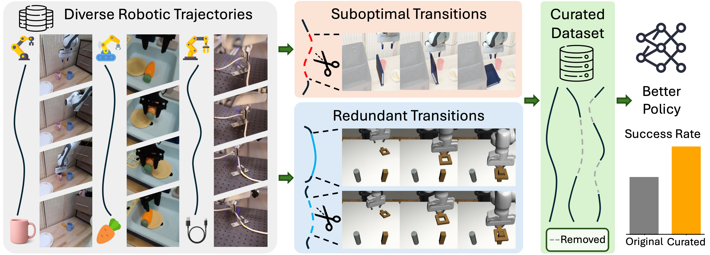

# SCIZOR: Self-Supervised Data Curation for Large-Scale Imitation Learning

<!-- add a image of the scizor logo -->



SCIZOR is a self-supervised data curation framework that removes suboptimal and redundant data from large-scale datasets and enhances imitation learning policy performance.

Code is coming soon!

## BibTeX

If you find this work useful, please cite it as follows:

```bibtex
@article{yu2025scizor,
  title={SCIZOR: Self-Supervised Data Curation for Large-Scale Imitation Learning},
  author={Zhang, Yu and Xie, Yuqi and Liu, Huihan and Shah, Rutav and Wan, Michael and Fan, Linxi and Zhu, Yuke},
  year={2025}
}
```
